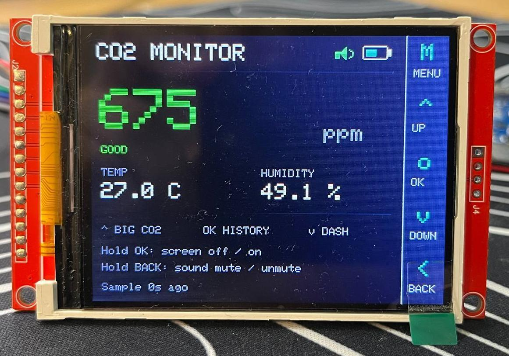
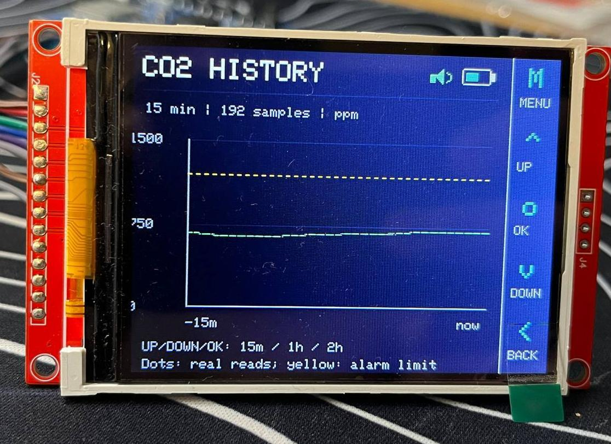
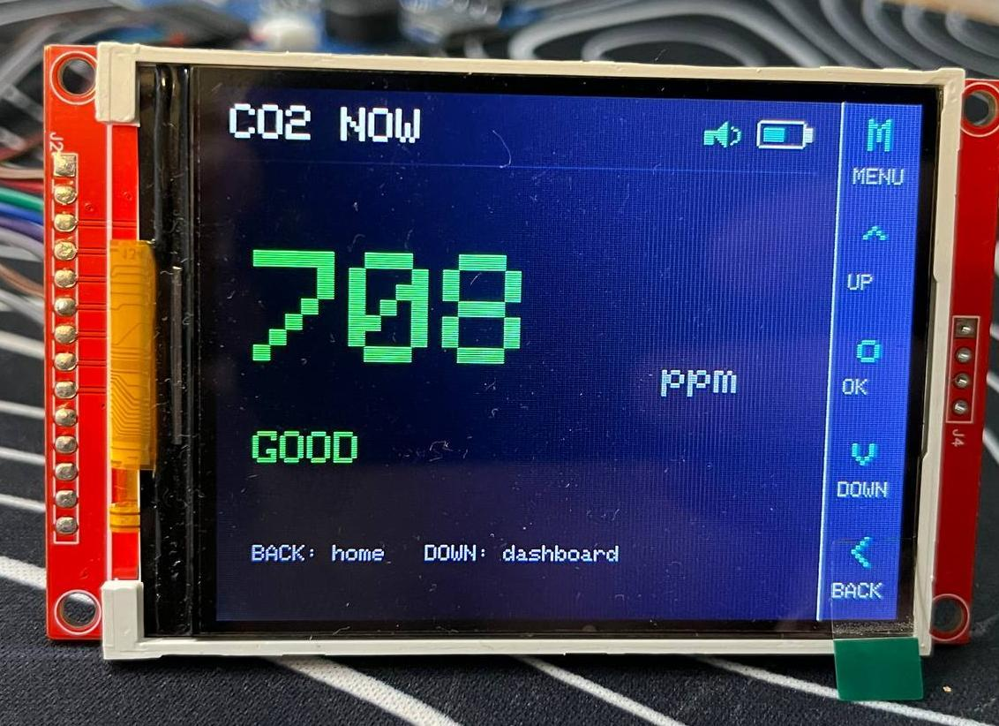
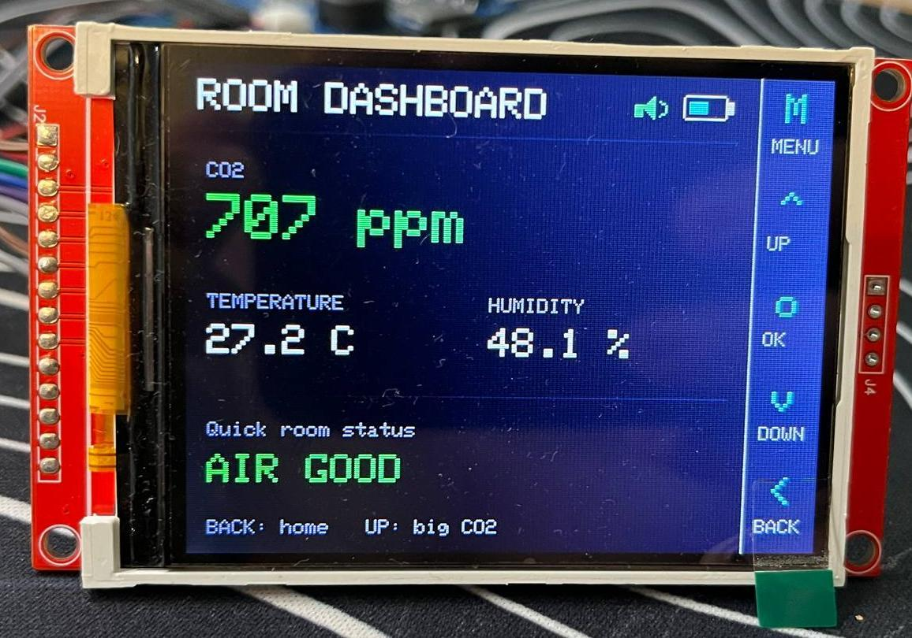
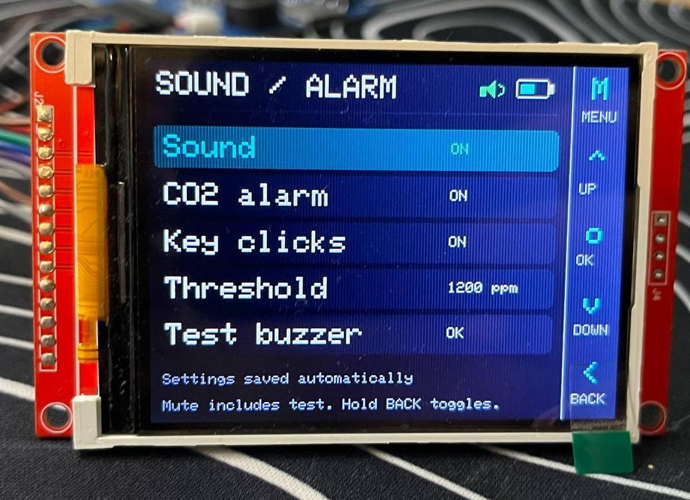

# Smart Indoor CO₂ Monitor

**ESP32-S3 · Sensirion SCD41 · Custom PCB · Embedded firmware**

A portable monitor that measures indoor CO₂ concentration, temperature and relative humidity. The project combines a custom PCB designed in Altium Designer, a battery-powered ESP32-S3 system and a graphical interface with live readings, measurement history and configurable acoustic alerts.

## Features

- **Live measurements:** CO₂ in ppm, temperature and relative humidity, with a colour-coded CO₂ status.
- **Multiple views:** main screen, large CO₂ display, room dashboard and graphical CO₂ history.
- **Five-button navigation:** MENU, UP, OK, DOWN and BACK, including shortcuts to the main views.
- **Acoustic alerts:** buzzer warnings with an adjustable CO₂ threshold and a mute function.
- **Portable operation:** rechargeable battery, USB-C charging and battery/sound status indicators.
- **Display standby:** the screen can be switched off while measurements continue.

## Interface

| Live measurements | CO₂ history |
| :---: | :---: |
|  |  |
| **Large CO₂ display** | **Room dashboard** |
|  |  |

Sound and alarm settings

## Hardware

| Function | Component |
| --- | --- |
| Microcontroller | Espressif ESP32-S3-WROOM-1-N8R8 |
| CO₂, temperature and humidity sensing | Sensirion SCD41-D-R2 |
| Display | 2.8-inch TFT, 320 × 240 pixels |
| USB-to-UART interface | Silicon Labs CP2102N-A02-GQFN28R |
| Voltage regulation | Texas Instruments TPS62152RGTT |
| Battery charging | Microchip MCP73834T-FCI/MF, with USB-C input |
| User input and alerts | Five navigation buttons and a TDK PS1720P02 piezo buzzer |

The [bill of materials](bill-of-materials.xlsx) lists the PCB components and their part numbers. It covers the board itself; it is not a complete shopping list for the assembled device, including the external display and battery.

## PCB development

The custom PCB was developed across two revisions:

- **Revision 1 — laboratory assembly:** we assembled two boards using stencil-applied solder paste, manually placed SMD components and a reflow oven. Assembly faults, including a short circuit on one board, highlighted the challenges of the manual process.
- **Revision 2 — assembled by JLCPCB:** we revised the board and used JLCPCB's PCBA service for component placement and soldering.

The [PCB fabrication PDF](pcb-fabrication.pdf) contains the board's component-placement and assembly drawings exported from Altium Designer.

## Firmware

We developed firmware to integrate the sensor, display, buttons, buzzer, and battery/charging status monitoring. Individual hardware components were tested incrementally before integration into the complete system.

The interface includes measurement views, history, settings and button shortcuts. Display updates were optimised to redraw only regions whose content has changed. Holding OK switches the display off or on; holding BACK toggles sound muting.

**Firmware source code is not included in this repository.** The files here document the hardware and the demonstrated prototype interface.

## Project files

| File | Contents |
| --- | --- |
| [Bill of materials](bill-of-materials.xlsx) | Original PCB BOM with component quantities and part numbers |
| [PCB fabrication PDF](pcb-fabrication.pdf) | Component-placement and assembly drawings |
| [Project description — German](project-description-de.pdf) | Development overview, operating instructions and prototype photographs |

## Team
Developed by **Nina-Ilenna Müller** and **Maksym Poizdnyk**.
